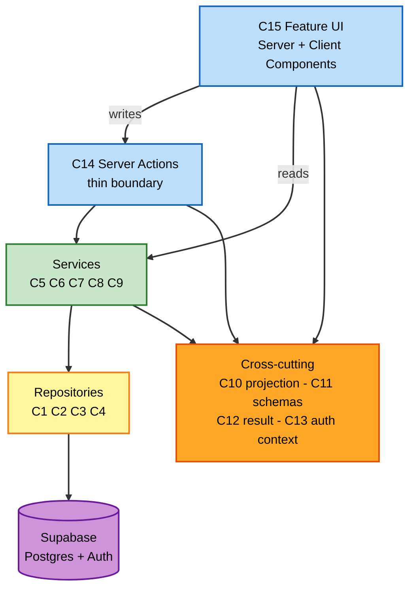

# Component Dependencies - Ride Buddy

**Stage**: INCEPTION - Application Design, Phase 4

---

## Layer Dependency Rule

Dependencies point in one direction only: UI to actions to services to repositories to
Supabase. Cross-cutting components (C10 projection, C11 schemas, C12 result, C13 auth
context) may be depended upon from any layer and depend on nothing but each other.



### Text Alternative

Included per `common/content-validation.md`.

```
C15 Feature UI ---- writes ---> C14 Server Actions ---> Services ---> Repositories ---> Supabase
C15 Feature UI ---- reads  -------------------------->  Services ---> Repositories ---> Supabase

Cross-cutting (C10 projection, C11 schemas, C12 result, C13 auth context)
  is depended upon by: C15 Feature UI, C14 Server Actions, Services
  depends on: nothing outside itself

Direction is strictly downward. No repository calls a service.
No service calls an action. Nothing calls the UI.
```

---

## Dependency Matrix

`X` means the row component depends on the column component.

| depends on -> | C1 | C2 | C3 | C4 | C5 | C6 | C7 | C8 | C9 | C10 | C11 | C12 | C13 |
|---|---|---|---|---|---|---|---|---|---|---|---|---|---|
| **C1** ProfileRepo | | | | | | | | | | | | | |
| **C2** AreaRepo | | | | | | | | | | | | | |
| **C3** RideRepo | | | | | | | | | | | | | |
| **C4** RequestRepo | | | | | | | | | | | | X | |
| **C5** AuthService | | | | | | | | | | | | X | |
| **C6** ProfileService | X | | | | | | | | | X | | X | X |
| **C7** AreaService | | X | | | | | | | | | | | |
| **C8** RideService | X | | X | | | X | | | X | X | | X | X |
| **C9** RequestService | X | | X | X | | X | | | | X | | X | X |
| **C10** Projection | | | | | | | | | | | | | |
| **C11** Schemas | | | | | | | | | | | | | |
| **C12** Result | | | | | | | | | | | | | |
| **C13** AuthContext | | | | | X | | | | | | | X | |
| **C14** Actions | | | | | X | X | | X | X | | X | X | X |
| **C15** UI | | | | | | X | X | X | X | | X | X | X |

C13 AuthContext wraps C5 AuthService and uses C12 Result. Cross-cutting components C10, C11
and C12 have empty rows by design - they depend on nothing, which is what makes them safe to
depend on from any layer.

---

## Acyclicity Verification (checklist 4.4)

The only cross-service dependencies are:

| From | To | Reason |
|---|---|---|
| C8 RideService | C9 RequestService | Cancellation cascade (FR-38) |
| C8 RideService | C6 ProfileService | Completeness gate before ride creation (FR-6) |
| C9 RequestService | C6 ProfileService | Completeness gate before seat request (FR-6) |

**No reverse edges exist.** Specifically:
- C9 does **not** call C8. When C9 needs ride data it uses C3 RideRepository directly. This is
  the single design choice that keeps the service graph acyclic - had C9 called C8 for ride
  lookups, C8 to C9 to C8 would be a cycle.
- C6 calls no other service.
- No repository calls any service.
- C10, C11, and C12 depend on nothing, which is what makes them safe to depend on from
  anywhere.

**Topological order**: C10, C11, C12 → C1, C2, C3, C4 → C5 → C13 → C6 → C9 → C8 → C14 → C15.
A valid ordering exists, therefore the graph is acyclic.

---

## Communication Patterns

| Boundary | Mechanism | Notes |
|---|---|---|
| Browser to server, writes | Server Action invocation | Returns a `Result` (C12) directly to the calling form |
| Browser to server, reads | Server Component render | No JSON endpoint; data is rendered server-side |
| Action to service | Direct function call | In-process; one call per action |
| Service to service | Direct function call | Only the three edges listed above |
| Service to repository | Direct function call | Synchronous, awaited |
| Repository to Supabase | Supabase client | The only place the client is used (AQ3=A) |
| Any layer to cross-cutting | Direct function call | Pure functions and type declarations |

**All communication is in-process.** There is one deployable (TC-1), so there are no network
hops, no serialisation contracts between components, no retries, and no partial-failure
handling between layers. The only remote boundary is the Supabase client call.

---

## Data Flow: the Eight-Step Demo Path (checklist 4.3)

Tracing `requirements.md` Section 10 through the components.

| Step | Action | Flow |
|---|---|---|
| 1 | Employee signs in | C15 form → C14 signInAction → C11 credentialsSchema → C5.signIn → Supabase Auth |
| 2 | Completes profile | C15 form → C14 updateProfileAction → C11 profileUpdateSchema → C6.updateMyProfile → C1.update |
| 3 | Creates a ride | C15 form → C14 createRideAction → C11 rideCreateSchema → C8.createRide → **C6.assertCanAct** → C3.create |
| 4 | Second employee searches and finds it | C15 → C8.searchRides → C3.searchUpcoming + C3.countAcceptedRequests → C1.findManyByUserIds → **C10.projectMany** → C15 |
| 5 | Requests a seat, no contact details | C15 → C14 requestSeatAction → C9.requestSeat → C6.assertCanAct, self-check, C4.findActiveByRideAndPassenger → C4.create |
| 6 | Driver sees name and area only | C15 → C9.listRequestsForMyRide → C4.listByRide → C1.findManyByUserIds → **C10.projectMany** → C15 |
| 7 | Driver accepts, capacity enforced | C15 → C14 acceptRequestAction → C9.acceptRequest → ownership + state checks → **C4.acceptWithCapacityGuarantee** |
| 8 | Both see phone and email | C15 → C9.listMyRequests / C9.listRequestsForMyRide → **C10.projectMany** now sees an ACCEPTED link and includes contact fields |

**Steps 4, 6, and 8 are the same projection component producing different output** from the
same code path, driven purely by the linking request status. Step 8 involves no write and no
copying of contact data - the fields simply stop being stripped. That is the design property
that makes FR-20 and FR-30 one rule rather than two features.

**Step 7 is the only step with a concurrency contract**, and it is confined to a single
repository method.

---

## Unit Assignment

Mapping components to the three units from the execution plan, so Construction knows what to
build when.

| Unit | Components introduced |
|---|---|
| **1 - Foundation** | C1, C2, C5, C6, C7, C11 (partial), C12, C13, C14 (auth + profile actions), C15 (auth + profile features) |
| **2 - Ride Offering and Discovery** | C3, C8, **C10**, C11 (ride schemas), C14 (ride actions), C15 (rides + search features) |
| **3 - Requests and Matching** | C4, C9, C14 (request actions), C15 (requests feature) |

**C10 arrives in Unit 2**, not Unit 3, because ride search must already withhold driver
contact details (US-13, FR-20) before any request exists. Placing it later would mean Unit 2
shipped with contact data exposed.

**C4 arrives in Unit 3** carrying the capacity guarantee, which is why the execution plan
made Unit 3 the largest.
