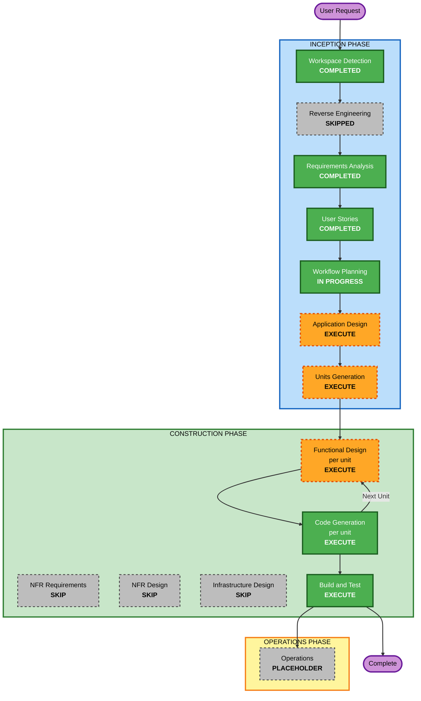

# Execution Plan - Ride Buddy

**Stage**: INCEPTION - Workflow Planning
**Date**: 2026-09-03
**Project Type**: Greenfield
**Status**: Awaiting approval

---

## 1. Context Loaded (Step 1)

| Source | Loaded | Notes |
|---|---|---|
| Reverse engineering artifacts | N/A | Greenfield - stage was skipped, no existing code |
| `requirements/requirements.md` | Yes | 42 FR, 9 NFR, 8 TC, 6 assumptions, 4 recorded deviations |
| `requirements/requirement-verification-questions.md` | Yes | 43 of 43 answered |
| `user-stories/stories.md` | Yes | 28 stories, 11 on the demo path, 5 promoted |
| `user-stories/personas.md` | Yes | Driver, Passenger, and the "Both" mode of use |

---

## 2. Detailed Analysis Summary (Step 2)

### 2.1 Transformation Scope
**Not applicable.** Greenfield project. There is no existing architecture to transform, no
CDK stacks, no cross-package impact, and no deployment model migration.

### 2.2 Change Impact Assessment

| Impact area | Present | Detail |
|---|---|---|
| **User-facing changes** | Yes | The entire application. All 42 functional requirements describe behaviour a person performs or observes. Two personas with asymmetric data visibility. |
| **Structural changes** | Yes | Whole architecture is new: single Next.js application whose API routes serve as the Node.js backend (TC-1). |
| **Data model changes** | Yes | Entire schema is new: profiles, areas, rides, ride requests. Versioned as migration SQL files (TC-5). |
| **API changes** | Yes | All endpoints are new. Contact-detail projection (NFR-2) makes response shape conditional on request status - not a uniform serialisation. |
| **NFR impact** | Yes, narrow | Authorization in two layers (NFR-1) and server-side contact projection (NFR-2) are real design work. Performance, scalability, and observability are explicitly minimal (NFR-4, NFR-8). |

### 2.3 Component Relationships
**Not applicable.** Greenfield, single deployable. No inter-package dependency graph exists.

### 2.4 Risk Assessment

- **Risk Level**: **LOW**
- **Rollback Complexity**: **Easy** - greenfield repository under git; no existing behaviour to
  regress, no production data, no consumers.
- **Testing Complexity**: **Simple** - Q20=A limits automated testing to seat availability and
  request state transitions.

**Risk factors considered and why they do not raise the level:**

| Factor | Assessment |
|---|---|
| Production exposure | None. TC-7 keeps the application on localhost. |
| Data sensitivity | Phone numbers and email addresses are personal data, but under seed and test conditions only. NFR-9 records the POC privacy posture. |
| Open signup deviation | `requirements.md` Section 9.1. Accepted decision; residual risk low **because** TC-7 keeps it local. Flagged BLOCKING for any public deployment. |
| Concurrency correctness | The one genuine correctness trap: FR-31 to FR-33 seat capacity. Contained by requiring database-level enforcement and by FR-22 fixing every request at one seat. |
| Schedule | The tightest constraint. `vision.md` targets roughly 4 hours. Drives the stage selections below. |

---

## 3. Phase Determination (Step 3)

### 3.1 User Stories
**COMPLETED.** Executed and approved. 28 stories, 2 personas.

### 3.2 Application Design - **EXECUTE**

Matches the execute criteria on three counts:
- **New components or services needed** - every component is new; nothing exists to reuse
- **Component methods and business rules need definition** - the seat-enforcement rule
  (FR-31 to FR-33) and the conditional contact projection (NFR-2) need a deliberate home,
  not incidental placement wherever they are first needed
- **Service layer design required** - TC-1 puts server logic in Next.js API routes, which
  makes it easy to scatter business rules across route handlers. Naming the service boundaries
  first is what prevents that.

**Depth**: standard, kept lean. The value is in deciding *where* the two cross-cutting rules
live, not in exhaustive method signatures.

### 3.3 Units Generation - **EXECUTE**

Matches four execute criteria: new data models and schemas, new API endpoints, complex
business logic, and state management changes (a six-state request lifecycle).

It is a fair question whether a single-deployable POC needs decomposition at all, and the
honest answer is that it does not need it for *structural* reasons - there is one Next.js app
and one database. The reason to execute is different: **Q43=A defines success as a clickable
end-to-end demo, and three units give three points at which something demonstrable exists.**
Against a 4-hour budget, that is the difference between having something to show at the
90-minute mark and having nothing until the end.

Proposed decomposition - 3 units, sequenced along the demo path:

| Unit | Name | Stories | What works at the end of it |
|---|---|---|---|
| 1 | **Foundation** | US-01 to US-05, US-28 | Sign in, complete a profile, areas seeded and selectable |
| 2 | **Ride Offering and Discovery** | US-06 to US-13, US-25 | Publish a ride, search and find it, see it without contact details |
| 3 | **Requests and Matching** | US-14 to US-24, US-26, US-27 | Request a seat, accept or reject, capacity enforced, contacts exchanged |

Rationale for the boundaries:
- **Unit 1** is pure prerequisite. Nothing else can be demonstrated without a signed-in user
  who has a home area.
- **Unit 2** completes demo steps 1 to 5 and is independently demonstrable: a driver publishes,
  a passenger finds. US-13 (contact details withheld) belongs here because it applies to
  search results.
- **Unit 3** carries all the state-machine and concurrency work, including the two
  correctness-critical stories US-22 and US-27. Deliberately last, and deliberately together -
  splitting the request lifecycle across units would leave a half-built state machine.

Dependencies are strictly linear: Unit 1 → Unit 2 → Unit 3. No parallelisation, which suits a
single developer.

---

## 4. Construction Phase Determination

### 4.1 Functional Design (per unit) - **EXECUTE**

Matches all three execute criteria: new data models and schemas, complex business logic, and
business rules needing detailed design.

Specifically needed:
- Table definitions, keys, and constraints for profiles, areas, rides, and ride requests
- **The seat-capacity constraint** - FR-33 rules out application-layer checking, so the
  transaction or constraint has to be designed, not improvised
- **RLS policies** - NFR-1 requires them as one of two authorization layers
- **The request state machine** - six states, seven transitions (FR-34 to FR-38)
- **Conditional contact projection** - NFR-2, which shapes API response contracts

### 4.2 NFR Requirements (per unit) - **SKIP**

Skip criteria met: **tech stack already determined** and **no new NFR requirements**.

TC-1 through TC-8 fix the entire stack - framework, language, styling, database, schema
management, seed strategy, deployment. NFR-1 through NFR-9 are already enumerated with
explicit values, including the deliberate minimums: no performance engineering (NFR-4),
console logging (NFR-8), no retention policy (NFR-9). There is nothing left to assess.

### 4.3 NFR Design (per unit) - **SKIP**

Dependent skip: the rules state NFR Design is skipped when NFR Requirements is skipped.

**Worth being explicit about what this does not mean.** Two non-functional requirements do
carry genuine design work - NFR-1 (two-layer authorization) and NFR-2 (server-side contact
projection). Skipping this stage does not discard them. **Both are absorbed into Functional
Design**, where the RLS policies and the API response contracts are designed anyway. This is
recorded so that a reader does not later find NFR Design skipped and conclude the security
design was never done.

### 4.4 Infrastructure Design (per unit) - **SKIP**

Skip criteria met: **infrastructure already defined**.

The complete infrastructure is a Supabase cloud project plus localhost (TC-4, TC-7). There is
no deployment architecture to design, no cloud resources to specify beyond the Supabase
project, no networking, no scaling, and no CI/CD. Assumption A-3 already records that the
user provisions the project and supplies the keys as environment variables.

### 4.5 Code Generation (per unit) - **EXECUTE (ALWAYS)**
Mandatory. Runs three times, once per unit, each with its own Part 1 planning and Part 2
generation.

### 4.6 Build and Test - **EXECUTE (ALWAYS)**
Mandatory, after all three units. Scope is bounded by Q20=A: build instructions plus unit
tests on seat availability and request state transitions.

---

## 5. Multi-Module Coordination
**Not applicable** (Step 5 is brownfield-only). Single deployable, three sequential units,
one developer.

---

## 6. Workflow Visualization (Step 6)



### Text Alternative

Included per `common/content-validation.md`, which requires a text version of any diagram.

```
INCEPTION PHASE
  Workspace Detection ....... COMPLETED
  Reverse Engineering ....... SKIPPED   (greenfield, no existing code)
  Requirements Analysis ..... COMPLETED (approved)
  User Stories .............. COMPLETED (approved)
  Workflow Planning ......... IN PROGRESS
  Application Design ........ EXECUTE
  Units Generation .......... EXECUTE   (3 units)

CONSTRUCTION PHASE - per-unit loop, 3 iterations
  Functional Design ......... EXECUTE   (per unit)
  NFR Requirements .......... SKIP      (tech stack already fixed by TC-1..TC-8)
  NFR Design ................ SKIP      (dependent; content absorbed into Functional Design)
  Infrastructure Design ..... SKIP      (infrastructure is Supabase cloud + localhost)
  Code Generation ........... EXECUTE   (per unit, always)
  Build and Test ............ EXECUTE   (once, after all units)

OPERATIONS PHASE
  Operations ................ PLACEHOLDER

UNIT SEQUENCE (strictly linear)
  Unit 1 Foundation -> Unit 2 Ride Offering and Discovery -> Unit 3 Requests and Matching
```

---

## 7. Phases to Execute

### INCEPTION PHASE
- [x] Workspace Detection (COMPLETED)
- [x] Reverse Engineering (SKIPPED - greenfield, no existing code to analyse)
- [x] Requirements Analysis (COMPLETED and APPROVED)
- [x] User Stories (COMPLETED and APPROVED)
- [x] Workflow Planning (IN PROGRESS)
- [ ] Application Design - **EXECUTE**
  - **Rationale**: All components are new. The seat-enforcement rule and the conditional
    contact projection are cross-cutting and need a deliberate home rather than incidental
    placement in whichever route handler needs them first.
- [ ] Units Generation - **EXECUTE**
  - **Rationale**: Not needed structurally - one app, one database. Executed because three
    units give three demonstrable milestones, which is what Q43=A's clickable-demo success
    criterion needs from a 4-hour budget.

### CONSTRUCTION PHASE
- [ ] Functional Design - **EXECUTE** (per unit)
  - **Rationale**: The schema, the seat-capacity constraint, the RLS policies, the six-state
    request machine, and the conditional response contracts all need designing.
- [ ] NFR Requirements - **SKIP**
  - **Rationale**: Tech stack fully determined (TC-1 to TC-8) and NFRs already enumerated
    with explicit values (NFR-1 to NFR-9). Nothing left to assess.
- [ ] NFR Design - **SKIP**
  - **Rationale**: Dependent skip. NFR-1 and NFR-2 do carry real design work; both are
    absorbed into Functional Design, where RLS policies and API contracts are designed
    anyway. Nothing is discarded.
- [ ] Infrastructure Design - **SKIP**
  - **Rationale**: Infrastructure is already defined and trivial - a Supabase cloud project
    plus localhost (TC-4, TC-7). No deployment architecture, networking, scaling, or CI/CD.
- [ ] Code Generation - **EXECUTE** (ALWAYS, per unit, 3 iterations)
  - **Rationale**: Mandatory. Each unit gets its own Part 1 planning and Part 2 generation.
- [ ] Build and Test - **EXECUTE** (ALWAYS)
  - **Rationale**: Mandatory. Scope bounded by Q20=A - build instructions plus unit tests on
    seat availability and request state transitions.

### OPERATIONS PHASE
- [ ] Operations - **PLACEHOLDER**
  - **Rationale**: Placeholder stage for future deployment and monitoring workflows. TC-7
    keeps this POC local, so there is nothing to deploy.

---

## 8. Stage Count

| | Count | Stages |
|---|---|---|
| **Completed** | 4 | Workspace Detection, Requirements Analysis, User Stories, Workflow Planning |
| **Skipped** | 5 | Reverse Engineering, NFR Requirements, NFR Design, Infrastructure Design, Operations |
| **Remaining to execute** | 4 stage types | Application Design, Units Generation, Functional Design (x3 units), Code Generation (x3 units), Build and Test |

Counting the per-unit loop, **11 stage executions** remain: Application Design, Units
Generation, then Functional Design and Code Generation once per unit for three units, then
Build and Test.

---

## 9. Estimated Timeline

`vision.md` targets roughly 4 hours. Indicative split:

| Stage | Estimate |
|---|---|
| Application Design | 10-15 min |
| Units Generation | 10 min |
| Unit 1 - Foundation (design + code) | 45-60 min |
| Unit 2 - Ride Offering and Discovery (design + code) | 60-75 min |
| Unit 3 - Requests and Matching (design + code) | 75-90 min |
| Build and Test | 20-30 min |
| **Total** | **3.5 - 4.5 hours** |

Unit 3 is the largest because it carries the state machine, the seat-capacity constraint, and
the conditional contact projection - the three genuinely fiddly parts.

**The estimate excludes** Supabase project provisioning, which per assumption A-3 is the
user's step.

---

## 10. Success Criteria

**Primary goal**: a clickable end-to-end demo of the eight-step path in `requirements.md`
Section 10, per Q43=A.

**Key deliverables**
- A running Next.js application with TypeScript, Tailwind, and shadcn/ui
- Supabase migration SQL files under `supabase/migrations/`
- A seed script providing demo employees, areas, and rides
- Unit tests on seat availability and request state transitions
- Build and test instructions

**Quality gates**
- All 28 user stories have their acceptance criteria met
- All 11 `[DEMO PATH]` stories work without a rough edge
- Seat capacity cannot be exceeded, including under concurrent acceptance (US-22)
- No phone number or email address appears in any API response for a non-accepted pair (US-27)
- The eight-step demo path is walkable start to finish

**Explicitly not a gate**: integration tests, end-to-end browser tests, public deployment,
performance targets, or a security review - each excluded by a recorded decision.
